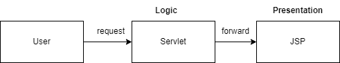

# Web Lab - JSP
This lab demonstrate how to develop basic web application using JSP. The project use Jetty as an embeded web server where the JSP will be built and deployed on. This web application simply have an HTML form that submit a parameter to servlet to process and show the result on JSP.

## BMI Calculator
This program helps to calculate bmi by given weight and height. The program should also determine if the built is normal, underweight, overweight, etc., based on given figure in calculate.jsp in webapp/bmi
1. complete the `index.html` with two textfields for weight and height. 
2. the form's action should be properly pointed to the servlet to calculate BMI. 
3. complete BMICalculatorServlet, BMI should be integer number without any decimal points (You can use `Math.round()` function).
4. The servlet should determine the built type based on the given BMI as following:
    - BMI < 18.5 : underweight
    - 18.5 <= BMI < 25 : normal
    - 25 <= BMI < 30 : overweight
    - 30 <= BMI < 35 : obese
    - BMI >= 35 : extremely obese
5. add bmi and built type to the request attributes.
3. compelte `bmi_result.jsp` to show bmi and built type from the request attributes.

## Testing
You must run test to verify with maven `verify` goal
