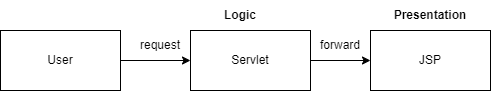

# Web Lab - JSP and Servlet

In this lab you build a basic web application with a Servlet and JSP. The project uses Jetty as an embedded web server. The application has an HTML form that submits parameters to a servlet, which processes them and shows the result on a JSP page.



> **Before you start:** review the in-class examples in [sample-web-servlet](https://github.com/cnacha-mfu/sample-web-servlet) — this lab uses exactly the same pattern as its calculator example (form → servlet → `setAttribute` → forward → JSP).

## How to run

Start the web server with:

```
mvn jetty:run
```

Then open <http://localhost:8080> in your browser. The server redeploys automatically a few seconds after you save a change.

## BMI Calculator

The program calculates BMI from a given weight and height, and also determines the built type. Complete the code wherever you see a `TODO`:

1. Complete `index.html`: add two text fields named `weight` and `height`, and point the form's `action` to the servlet.
2. Complete `BMICalculatorServlet`:
   - Map it to the URL `/calbmi` with `@WebServlet`.
   - Read the `weight` and `height` parameters from the request.
   - Calculate the BMI: weight divided by height squared. The result must be a whole number without decimal points (use `Math.round()`).
   - Determine the built type from the BMI:
     - BMI < 18.5 : `underweight`
     - 18.5 <= BMI < 25 : `normal`
     - 25 <= BMI < 30 : `overweight`
     - 30 <= BMI < 35 : `obese`
     - BMI >= 35 : `extremely obese`
   - Add the BMI and the built type to the request attributes.
   - Forward to `bmi_result.jsp`.
3. Complete `bmi_result.jsp`: show the BMI and the built type from the request attributes.

Try it in the browser: enter a weight and height in the form and submit. For example, weight `70` and height `1.5` should show `Result is 31` and `obese`.

## Testing

The test in `src/test/java` starts the server, sends real HTTP requests to `/calbmi`, and checks the response. This is the same test used for grading, so run it before you submit.

**Important:** stop your running server first (port 8080 must be free), then run:

```
mvn verify
```

You should see `BUILD SUCCESS`.

## Challenge: Dynamic Web Interface

Create a nice HTML page with JavaScript that calls the servlet dynamically, so the result appears without a full page reload (see the AJAX example in the sample project).

## Submit your lab

1. Commit and push your code back to GitHub.
2. Open your repository on GitHub and check that the autograding shows a green checkmark (it may take a minute to run). A red X means the grading test failed — check the **Actions** tab to see why, fix your code, and push again.
